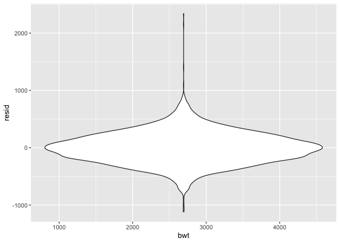

HW6
================
QiLu
11/22/2019

## Problem 1

``` r
child_data = read.csv(file = "./data/birthweight.csv") %>% 
  janitor::clean_names() %>% 
  mutate(
    babysex = as.factor(babysex),
    frace = as.factor(frace),
    malform = as.factor(malform),
    mrace = as.factor(mrace)
  ) %>% 
  drop_na()
 
  
#child_data = map(child_data, as.factor) %>% 
#  as.tibble()
```

Fit a linear model

``` r
bwt_full = lm(bwt ~ ., data = child_data)
summary(bwt_full)
```

    ## 
    ## Call:
    ## lm(formula = bwt ~ ., data = child_data)
    ## 
    ## Residuals:
    ##      Min       1Q   Median       3Q      Max 
    ## -1097.68  -184.86    -3.33   173.09  2344.15 
    ## 
    ## Coefficients: (3 not defined because of singularities)
    ##               Estimate Std. Error t value Pr(>|t|)    
    ## (Intercept) -6265.3914   660.4011  -9.487  < 2e-16 ***
    ## babysex2       28.7073     8.4652   3.391 0.000702 ***
    ## bhead         130.7781     3.4523  37.881  < 2e-16 ***
    ## blength        74.9536     2.0217  37.075  < 2e-16 ***
    ## delwt           4.1007     0.3948  10.386  < 2e-16 ***
    ## fincome         0.2898     0.1795   1.614 0.106551    
    ## frace2         14.3313    46.1501   0.311 0.756168    
    ## frace3         21.2361    69.2960   0.306 0.759273    
    ## frace4        -46.9962    44.6782  -1.052 0.292912    
    ## frace8          4.2969    74.0741   0.058 0.953745    
    ## gaweeks        11.5494     1.4654   7.882 4.06e-15 ***
    ## malform1        9.7650    70.6259   0.138 0.890039    
    ## menarche       -3.5508     2.8951  -1.226 0.220083    
    ## mheight         9.7874    10.3116   0.949 0.342588    
    ## momage          0.7593     1.2221   0.621 0.534418    
    ## mrace2       -151.4354    46.0453  -3.289 0.001014 ** 
    ## mrace3        -91.3866    71.9190  -1.271 0.203908    
    ## mrace4        -56.4787    45.1369  -1.251 0.210901    
    ## parity         95.5411    40.4793   2.360 0.018307 *  
    ## pnumlbw             NA         NA      NA       NA    
    ## pnumsga             NA         NA      NA       NA    
    ## ppbmi           4.3538    14.8913   0.292 0.770017    
    ## ppwt           -3.4716     2.6121  -1.329 0.183913    
    ## smoken         -4.8544     0.5871  -8.269  < 2e-16 ***
    ## wtgain              NA         NA      NA       NA    
    ## ---
    ## Signif. codes:  0 '***' 0.001 '**' 0.01 '*' 0.05 '.' 0.1 ' ' 1
    ## 
    ## Residual standard error: 272.5 on 4320 degrees of freedom
    ## Multiple R-squared:  0.7183, Adjusted R-squared:  0.717 
    ## F-statistic: 524.6 on 21 and 4320 DF,  p-value: < 2.2e-16

Let’s look at the p-value, at the 0.05 significant level, babysex,
bhead, blength, delwt,gaweeks, mrace, parity and smoken are fail to
reject the null hypothesis that coefficients are zero. However, an ANOVA
test can optimize this model. I decided to test mom’s race and parity
which have higher p-value compared to others.

``` r
# ANOVA test
bwt_lm = lm(bwt ~ babysex + bhead + blength + delwt + gaweeks + mrace + parity + smoken, data = child_data)
bwt_test = lm(bwt ~ babysex + bhead + blength + delwt + gaweeks + smoken, data = child_data)

anova(bwt_full, bwt_test) %>% 
  broom::tidy()
```

    ## # A tibble: 2 x 6
    ##   res.df        rss    df      sumsq statistic   p.value
    ##    <dbl>      <dbl> <dbl>      <dbl>     <dbl>     <dbl>
    ## 1   4320 320724338.    NA        NA       NA   NA       
    ## 2   4335 344636384.   -15 -23912046.      21.5  2.74e-57

Therefore, we reject the null hypothesis. mom’s race and parity can be
included as predictors. I use bwt\_lm as my linear model as the
following

``` r
summary(bwt_lm)
```

    ## 
    ## Call:
    ## lm(formula = bwt ~ babysex + bhead + blength + delwt + gaweeks + 
    ##     mrace + parity + smoken, data = child_data)
    ## 
    ## Residuals:
    ##      Min       1Q   Median       3Q      Max 
    ## -1119.67  -181.24    -5.87   173.51  2340.76 
    ## 
    ## Coefficients:
    ##               Estimate Std. Error t value Pr(>|t|)    
    ## (Intercept) -5822.5934    98.8325 -58.914  < 2e-16 ***
    ## babysex2       28.6609     8.4951   3.374 0.000748 ***
    ## bhead         131.6982     3.4607  38.056  < 2e-16 ***
    ## blength        75.8653     2.0210  37.538  < 2e-16 ***
    ## delwt           2.2649     0.1961  11.550  < 2e-16 ***
    ## gaweeks        12.1400     1.4654   8.284  < 2e-16 ***
    ## mrace2       -146.7893     9.2435 -15.880  < 2e-16 ***
    ## mrace3        -71.5880    42.4809  -1.685 0.092026 .  
    ## mrace4       -119.5979    18.7656  -6.373 2.04e-10 ***
    ## parity         98.6113    40.5334   2.433 0.015021 *  
    ## smoken         -4.7472     0.5882  -8.071 8.96e-16 ***
    ## ---
    ## Signif. codes:  0 '***' 0.001 '**' 0.01 '*' 0.05 '.' 0.1 ' ' 1
    ## 
    ## Residual standard error: 273.8 on 4331 degrees of freedom
    ## Multiple R-squared:  0.7148, Adjusted R-squared:  0.7142 
    ## F-statistic:  1086 on 10 and 4331 DF,  p-value: < 2.2e-16

Showing the plot of model residuals against fitted values

``` r
child_data %>% 
  modelr::add_residuals(bwt_lm) %>% 
  ggplot(aes(x = bwt, y = resid)) + geom_violin()
```

<!-- -->

``` r
cv_df = 
  crossv_mc(child_data, 100) 

cv_df %>% pull(train) %>% .[[3]] %>% as_tibble
```

    ## # A tibble: 3,473 x 20
    ##    babysex bhead blength   bwt delwt fincome frace gaweeks malform menarche
    ##    <fct>   <int>   <int> <int> <int>   <int> <fct>   <dbl> <fct>      <int>
    ##  1 2          34      51  3629   177      35 1        39.9 0             13
    ##  2 1          34      48  3062   156      65 2        25.9 0             14
    ##  3 2          36      50  3345   148      85 1        39.9 0             12
    ##  4 2          34      52  3374   156       5 1        41.6 0             13
    ##  5 1          33      52  3374   129      55 1        40.7 0             12
    ##  6 2          33      49  2778   140       5 1        37.4 0             12
    ##  7 1          36      52  3515   146      85 1        40.3 0             11
    ##  8 2          35      51  3317   130      55 1        43.4 0             13
    ##  9 1          35      51  3459   146      55 1        39.4 0             12
    ## 10 2          35      48  3175   158      75 1        39.7 0             13
    ## # … with 3,463 more rows, and 10 more variables: mheight <int>,
    ## #   momage <int>, mrace <fct>, parity <int>, pnumlbw <int>, pnumsga <int>,
    ## #   ppbmi <dbl>, ppwt <int>, smoken <dbl>, wtgain <int>

``` r
cv_df =
  cv_df %>% 
  mutate(
    train = map(train, as_tibble),
    test = map(test, as_tibble))

cv_df = 
  cv_df %>% 
  mutate(linear_mod  = map(train, ~lm(bwt ~ babysex + bhead + blength + delwt + gaweeks + mrace + parity + smoken, data = child_data)),
         main_mod = map(train, ~lm(bwt ~ blength + gaweeks, data = child_data)),
         inter_mod = map(train, ~lm(bwt ~ bhead * blength * babysex, data = child_data)))
```
